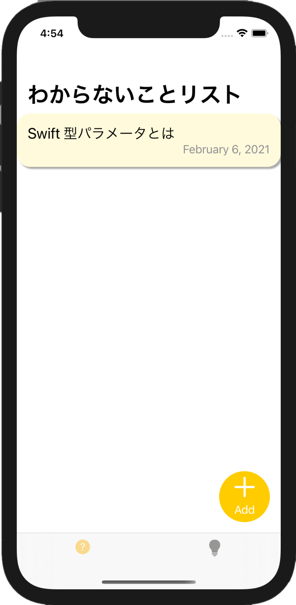
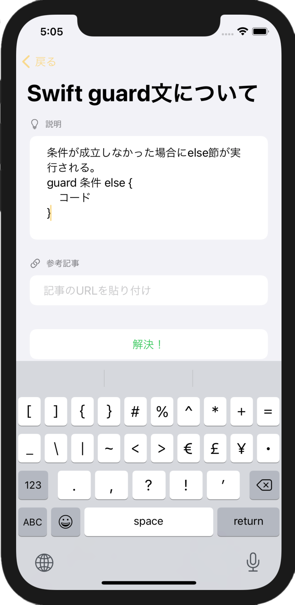
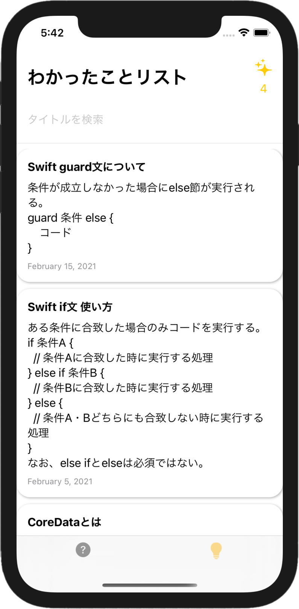

# 勉強サポートアプリ「わかりすと」

## 1.概要

「わからないことリスト」と「わかったことリスト」の2画面（新規作成、編集画面除く）で構成。わからないことをリストアップし、解決方法を見出してメモをつけるとリストから消え、わかったことリストに保存される。ToDoリストとメモを合わせたようなアプリ。

インストール（App Storeへのリンク）は[こちら](https://apps.apple.com/jp/app/id1553876980)

## 2.対応機種・対応OS

- iOS14.0以降
- iPhone8以降  

## 3.利用方法

①わからないことリストに自分の疑問、課題をひとつずつリストアップする。  

②解決した項目を選び、タップするとメモできる画面に遷移する。  

③メモや参考にした記事のURLを書き、「解決！」ボタンを押す。

④わからないことリストから選んだ項目が消え、わかったことリストに保存されている。  

## 4.目指した課題解決

- 勉強や課題に取り組んでいるときに何がわかっていないのか言語化したい。

- 解決した疑問をストックし、もう1度調べるときの手間を減らしたい。

## 5.洗い出した要件

- ToDoリスト（わからないことリスト）  
勉強や課題、プロジェクトに取り組む中でわからないことをリストアップする。解決したらリストから消える。

- メモ（わかったことリスト）  
わからないことにメモをつけ、わかったこととして保存する。

## 6.こだわった点

### 1.完全ローカル環境で使えること  
他のユーザーの情報を取り入れず、自分だけのノートにしたかった。

### 2.「わかったこと」のリスト数を表示  
わかったことリスト画面にその数を表示した。自分がどれだけ勉強したか、成長できたかの指標になり、勉強のモチベーションになると考えたため。  

## 7.今後の実装予定

- Twitterと連携し、どのくらい勉強したかアピールできるようにする

- 現段階ではiPhoneのみ使用可能であるため、iPad、Macにも対応させる。

## 8.DB設計

Questionテーブル（わからないこと）  

Attribute | Type
-|-
date | Date
content | String

Answerテーブル（わかったこと）  
Attribute | Type
-|-
date | Date
title | String
solution | String
url | String

関連付けはなし。AnswerのtitleはQuestionのcontentがそのまま入る仕様になっている（保存後に編集可能）。
